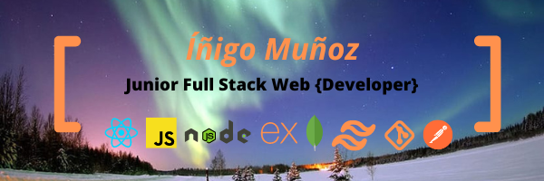

# Hola, Soy Iñigo 👋

## 👱‍♂️ Sobre mí

Soy Junior Full-Stack Web Developer me gusta hacer que la vida de los demás sea más sencilla.

## 👨‍💻 Actualmente Trabajando: 

Proyecto personal https://beemoving.netlify.app/.

## 📦 Proyectos recientes en los que he trabajado

- MiEcoCaja - Proyecto final en Ironhack - Comercialización de cajas con productos ecológicos. 🥔  
  React && ExpressJS && Javascript && HTML5 && CSS3 && TailwindsCSS 
  Repositorio: <a href="https://github.com/luthiwd/cajas-ecologicas-client">FRONT-END</a> <a href="https://github.com/luthiwd/cajas-ecologicas-server">BACK-END</a> 
  Demo Online: <a href="https://ecocajas.netlify.app/">DEMO</a>  
- Vinegar - Segundo proyecto en Ironhack - App para gestión de rutinas de ejercicios 🏋️‍♀️ 
  ExpressJS && HandleBars && Javascript && HTML5 && CSS3 && BootstrapCSS 
  Repositorio: <a href="https://github.com/Csriso/word-gym">Enlace</a> 
  Demo Online: <a href="https://vinegar-trainer.herokuapp.com/">DEMO</a>  

- Cats - Primer proyecto en Ironhack - Minijuego Arcade 🙀 
  Vanilla Javascript && HTML5 && CSS3 
  Repositorio: <a href="https://github.com/luthiwd/Cats">Enlace</a> 
  Demo Online: <a href="https://luthiwd.github.io/cats/">DEMO</a>  

## 📊 GitHub Stats

 

## 📈 Other Stats

## 🔧 Technologies

## 🔗 Connect

  
  

<!--
**Luthiwd/Luthiwd** is a ✨ _special_ ✨ repository because its `README.md` (this file) appears on your GitHub profile.

Here are some ideas to get you started:

- 🔭 I’m currently working on ...
- 🌱 I’m currently learning ...
- 👯 I’m looking to collaborate on ...
- 🤔 I’m looking for help with ...
- 💬 Ask me about ...
- 📫 How to reach me: ...
- 😄 Pronouns: ...
- ⚡ Fun fact: ...
-->
